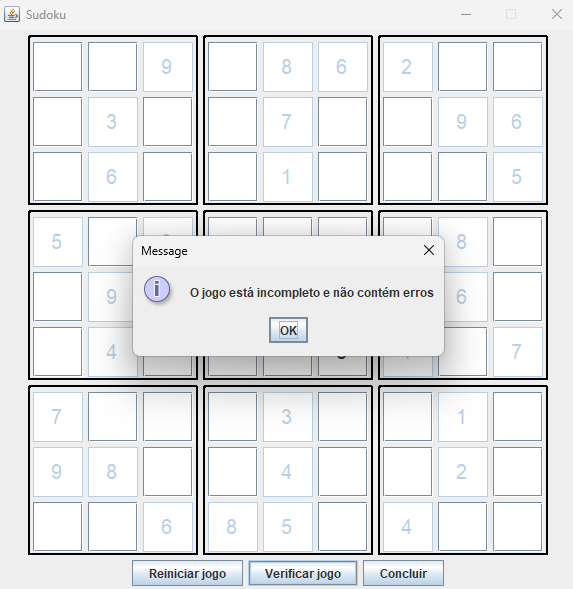
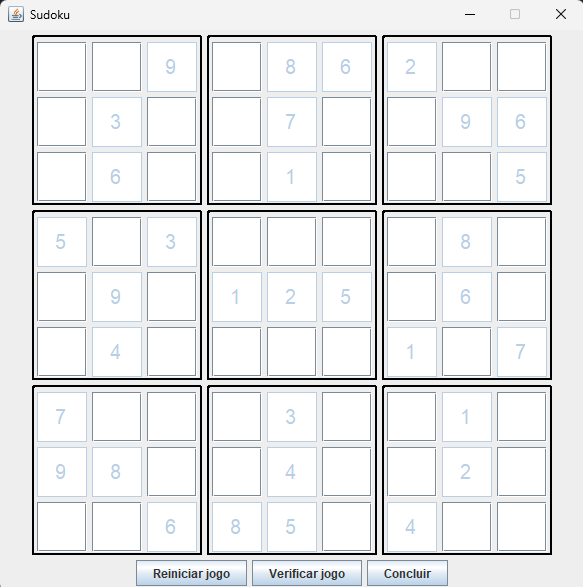

# 🧩 Sudoku em Java (Swing)

<div align="center">
  
</div>

---

## 📌 Sobre o Projeto
Este projeto foi desenvolvido durante uma **imersão em Java** e implementa um **jogo completo de Sudoku** com **interface gráfica feita em Swing**.  
O jogador pode interagir com o tabuleiro clicando nas células, preenchendo números e tentando completar o desafio seguindo as regras clássicas do Sudoku.

---

## 🎯 Objetivo
O objetivo deste projeto foi criar uma aplicação interativa de Sudoku, permitindo que o jogador complete o tabuleiro respeitando as regras do jogo.

## 🖥️ Tecnologias Utilizadas
- **Java 21** 
- **Swing** (interface gráfica)
- **Paradigma Orientado a Objetos**
- **Eventos e Listeners** para interação do usuário

## 📂 Estrutura do Projeto
```
src/
├── br/com/dio/model       # Classes de modelo (representação do tabuleiro e espaços)
├── br/com/dio/service     # Lógica do jogo, validações e eventos
├── br/com/dio/ui          # Interface gráfica do jogo
└── resources/             # Imagens e ícones utilizados no projeto
```

## 🚀 Como Executar
1. Clone o repositório:
```bash
git clone https://github.com/JulianaMichelsen/Sudoku_java.git
```
2. Abra o projeto em sua IDE Java (IntelliJ, Eclipse, NetBeans etc.).
3. Certifique-se de que o **JDK 17** (ou superior) está configurado.
4. Compile e execute a classe principal `UIMain.java`.


---

## 🚀 Funcionalidades
✅ **Interface gráfica amigável** usando Java Swing  
✅ **Validação do jogo**
✅ **Botão de reinício** para começar um novo jogo  
✅ **Geração de tabuleiro** pronto para jogar  
✅ **Verificação de vitória** 

---

## 🛠️ Tecnologias Utilizadas
- ☕ **Java** (versão `21`)
- 🎨 **Swing** para interface gráfica
- 📦 **POO** para organização do código
- 🔢 Manipulação de **arrays bidimensionais** para lógica do jogo

---

📸 Capturas de Tela
<div align="center">   </div>

___
📚 Aprendizados
Durante o desenvolvimento deste projeto, foram reforçados conceitos como:

Criação de interfaces gráficas com Swing

Programação Orientada a Objetos

Manipulação e validação de matrizes

Tratamento de eventos (ActionListener e MouseListener)

___


🤝 Contribuição
Se quiser contribuir com melhorias:

Faça um fork do projeto

Crie uma branch para sua funcionalidade (git checkout -b minha-melhoria)

Envie um pull request


___


## 📄 Licença
Este projeto está sob a licença MIT — sinta-se à vontade para utilizá-lo e modificá-lo.
